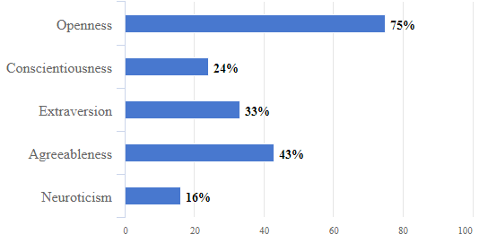

[Quantic Foundry](https://goo.gl/B1y6BL) - Personality: Big Five Profile

## Curious, Spontaneous, Introverted, and Emotionally Reactive
Your personality profile consists of your percentile rank across five key personality traits. Your scores are based on how you rank relative to other people. In this customized report, we’ll explain how to interpret these scores and what personality traits we measured.

### The Big Five Personality Traits
This personality profile is based on a validated assessment tool used in personality psychology research known as the Big Five Personality Traits. These traits were identified through empirical research over multiple decades and the model has been shown to be robust, reliable, and cross-culturally valid.

### A Quick Word on Percentiles
Your scores on this personality profile are percentiles–how you rank relative to other people. In this report, your percentiles are how you compared with a sample of 132,515 general Internet users of a similar age. This sample was collected by and reported in Srivastava, John, & Gosling (2003).

> A percentile of 80% means that you scored higher than 80% of people of your age from the sample. Conversely, a percentile of 10% means 90% of people of your age had a higher score than you. This means that a 50% is perfectly average. Most people will have high scores on 1-2 personality traits, low scores on another 1-2 traits, and their remaining scores will fall near the average (in the 35%-65% range). Thus, it’s your non-average traits that most define your profile as a person.

> Reference: Srivastava, S., John, O. P., Gosling, S. D., & Potter, J. (2003). Development of personality in early and middle adulthood: Set like plaster or persistent change? Journal of Personality and Social Psychology, 84, 1041-1053.

> One Last Word on “Good” vs. “Bad” Traits

> It is easy to interpret Big Five traits as being positive or negative, but we caution against this reading. First, different traits are helpful for different contexts. For example, guarded skepticism is beneficial for lawyers, but less helpful for elementary school teachers. Second, extreme scores (on either end) can be equally challenging. For example, people with extreme Introversion may have trouble with social interactions, while people with extreme Extraversion may crave excitement to the point of being reckless.

### Openness to Experience (75%)
People who score high on Openness are inquisitive and imaginative. They like to think about “what can be” instead of “what is”. They like to think deeply and play with abstract, unconventional ideas. They enjoy trying out new things and visiting new places. They are creative, and enjoy art and aesthetic experiences.

People who score low on Openness are practical and grounded. They are down-to-earth, traditional, and conventional. They are focused on facts and reality, and they prefer the routine and the familiar. They seek out the stability and security that comes from conforming to widely-shared, traditional values.
> Extreme Scores: People with extreme high scores may be overly idealistic and unpractical in their pursuits, and hold radical social or political beliefs. People with extreme low scores may have trouble with tasks that require creativity, and fear social change of any degree.

> Notes: Openness shares some traits with MBTI’s Sensing/Intuition dimension, but personality research has found that Openness also correlates with artistic interests, novelty-seeking, adventurousness, and preference for conservative/liberal political beliefs. The Sensing/Intuition dimension is centered on how people process data, whereas Openness is centered on the willingness to experiment and try new things in general.

### Conscientiousness (24%)
People who score high on Conscientiousness are organized and self-disciplined. They make plans and follow routines and schedules. They have a strong sense of duty and obligation. They work hard to achieve excellence and success. They are persistent, efficient, and reliable workers. They take their time to consider outcomes and alternatives when making decisions.

People who score low on Conscientiousness are spontaneous and flexible. They are adaptable and react well to unexpected situations and change. They find rules to be arbitrary and stifling, and don’t mind breaking them. They enjoy living life on a moment-to-moment basis, following their own whims, and often take leaps of faith to see what happens next.

> Extreme Scores: People with extreme high scores may be inflexible, react poorly to change, and overly cautious or meticulous with every aspect of their lives. People with extreme low scores may feel they don’t have control over their lives, and are so easily distracted that they have trouble completing tasks at work or school.

> Notes: The Conscientiousness trait is quite similar to the MBTI’s Judging/Perceiving dimension. In standard Big Five reports however, the description of low Conscientiousness is often far more judgmental (as the label implies) than how the Perceiving style is described.

### Extraversion (33%)
People who score high on Extraversion like being around people and are energetic, enthusiastic, and active in their everyday lives. They like constantly being on the move, enjoy big parties and crowds, and crave excitement and sensory stimulation. They are cheerful, optimistic, and make friends easily. They like to speak out, take charge, and are natural leaders.

People who score low on Extraversion are quiet, low-key, and are perfectly happy spending time alone. They tend to be reserved in social situations and keep in the background. They prefer quiet, peaceful, and relaxed environments. Their typical mood and disposition is more subdued and neutral. They are slower to reach out to others and tend to have a small circle of close friends.

> Extreme Scores: People with extreme high scores may be reckless in their excitement-seeking, or overly assertive and domineering in collaborative projects. On the other hand, people with extreme low scores may be painfully shy in social situations and have trouble with making friends.

> Notes: In addition to the social/solitary aspect of how Extraversion/Introversion is commonly understood in pop culture, Big Five personality research has also found that this trait is highly correlated with assertiveness, excitement-seeking, and cheerfulness. The Big Five definition of Extraversion is actually quite a bit broader than what most people assume.

### Agreeableness (43%)
People who score high on Agreeableness are sympathetic and compassionate. They value cooperation, social harmony, and assume that most people are fair and honest. They are naturally trusting and sincere in their dealings with other people. They are modest, dislike confrontation, and always willing to compromise to get along with others.

People who score low on Agreeableness tend to be objective and skeptical. They are vigilant about other people’s motivations and tend to be more guarded and strategic in their interactions with other people. They are direct in their communication style and don’t mind openly confronting or challenging others. They value truth, justice, and making objective judgments based on reason alone.

> Extreme Scores: People with extreme high scores may always compromise to their own detriment, and have trouble teasing apart emotions and facts when making important decisions. People with extreme low scores may be overly competitive, manipulative, and disregard other people’s emotional well-being.

> Notes: Low Agreeableness may sound like a bad thing at first, but rational skepticism and direct communication can be assets in many occupations, such as in legal, scientific, or engineering careers. Whereas the MBTI’s Thinking/Feeling dimension is more centered on decision-making, the Big Five’s Agreeableness trait is more centered on trust and sympathy towards other people in general.

### Neuroticism (16%)
People who score high on Neuroticism are reactive and sensitive. They often worry about things, especially when under stress, and become nervous and tense. They are sensitive about what other people think of them, and are easily embarrassed or discouraged.

People who score low on Neuroticism are calm and relaxed even in stressful and anxiety-provoking situations. They are even-keeled, fearless, and remain poised and confident when under pressure. They are difficult to provoke and are able to easily resist urges and temptations.

> Extreme Scores: People with extreme low scores may come across as being emotionless or lacking the appropriate response to dangerous situations. People with extreme high scores may be easily overwhelmed with negative thoughts and feelings, and have a tendency to become depressed.

> Notes: It may not be obvious at first how emotional reactivity may be beneficial from an evolutionary standpoint, but worrying about how things will turn out and being somewhat sensitive to other people’s perception of us can increase our drive and productivity. It’s when these internal thoughts are on overdrive that they become maladaptive.

