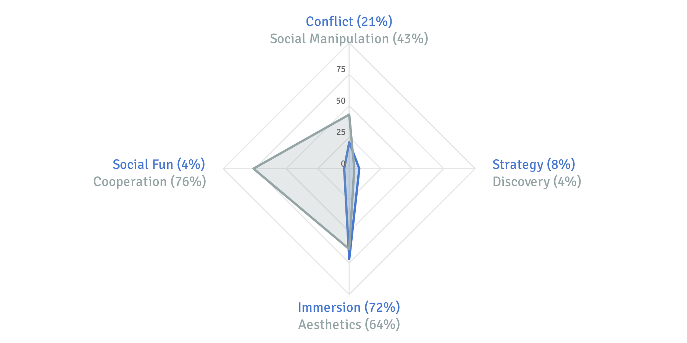

[Quantic Foundry](https://goo.gl/VTzz6e) - Board Games Motivation Profile

## Low Conflict, Relaxed, Immersed, and Independent
Your profile consists of your percentile rank across a broad range of gaming motivations. Your scores are based on how strong your motivations are relative to other gamers. In this customized report, we’ll explain how to interpret these scores and what motivations we measured.

### Preliminary Model of 4 Motivations Clusters
We identified 4 clusters of motivations. In each, there is a primary component and one or more secondary components (i.e., a related modifier or addition). In general, motivations within the same cluster tend to be positively correlated — e.g., if you score high on the primary motivation, you are more likely to score high on the secondary ones. On the other hand, motivations between clusters tend to be statistically unrelated—i.e., they neither suppress or predict each other. We’ll walk you through all these motivations and components below.

### A Quick Word on Percentiles
Percentiles are how you rank relative to other people. In this report, your percentiles are how you compared with other gamers who have participated in this profile tool. A percentile of 80% means you scored higher than 80% of gamers. Conversely, a percentile of 10% means 90% of gamers had a higher score than you. This means that a 50% is perfectly average.

> Most people will have high scores on 2-3 motivations, low scores on another 2-3 motivations, and the remaining scores will fall near the average (in the 35%-65% range). Thus, it’s your non-average scores that most define your profile as a gamer.

> Keep in mind that this isn’t a competition or a test. High scores are not “better” in any objective way. Gamers with extreme motivations (on both the low and high end) represent a smaller proportion of gamers and may have a harder time being satisfied by available games.

> It bears emphasizing that the percentile scores are relative to other board gamers. When compared with the general population, most people who are interested in board games are more interested in cognitive challenges. So comparisons with the general population are not that interesting in terms of profiling. Thus, we use the board gaming population as the baseline comparison.

### Conflict (21%) - High Conflict vs. Low Conflict

Gamers with high Conflict scores tend be more competitive and enjoy games where players can take hostile actions directly against each other. This could be stealing another player’s resources, forcing them to discard, blocking their move, or directly attacking and destroying their units/buildings. Confrontational mechanics often create more tense and dynamic gameplay because the stakes are higher and no outcome is certain until all the actions resolve. When you play the game of thrones, you win or you die; there is no middle ground.

Conversely, players who score low on Conflict prefer games that minimize direct and hostile confrontations (which high Conflict gamers may perceive as being boring “walled off” gardens).

> In our data from over 48,000 gamers, these are the most frequently mentioned games from gamers who score high on Conflict: Runewars, Forbidden Stars, Spartacus: A Game of Blood & Treachery, A Game of Thrones: The Board Game, and Twilight Imperium.

> Gamers who score low on Conflict frequently mention Signorie, Gingkopolis, Rococo, La Granja, and Glass Road.

### Secondary Motivation: Social Manipulation (43%)
Gamers who score high on Social Manipulation enjoy playing psychological mind games, where outcomes aren’t determined by dice or rulebooks, but instead by their ability to bluff, deceive, and persuade other players. The social arena of trust and negotiation is their favored battleground. They enjoy games where they have to convince other players of something (especially if it’s a lie). Sure, sometimes their friends may hate them when the game ends, but what good are friends that you can’t lie to from time to time?

On the other hand, gamers who score low on Social Manipulation prefer more transparent and concrete gameplay mechanics where deception doesn’t play a role.

> In our data from over 48,000 gamers, these are the most frequently mentioned games from gamers who score high on Social Manipulation: Diplomacy, The Resistance, Sheriff of Nottingham, Coup, and One Night Ultimate Werewolf.

> Gamers who score low on Social Manipulation frequently mention Madeira, Macao, Fields or Arle, Tobago, or Saint Petersburg.

### Strategy (8%) - Strategic vs. Relaxed
Gamers with high Strategy scores enjoy taking on cognitive challenges. For them, games are a way to hone and test their intellectual abilities. Thus, they prefer games that require a lot of thinking and planning, reward sound decisions, and where strategic mastery and skill (rather than luck) are the primary determinants of the game’s outcome. They enjoy complexity, whether this comes from an intricate ruleset or overlapping mechanics that have short and long term trade-offs. They prefer slower paced games that give them the time to ponder their moves, and more incremental gameplay where elaborate or interesting strategies can be planned and executed.

Gamers who score low on Strategy want a more relaxed gameplay experience where decisions don’t have much long-term impact, and they can enjoy the game on a more moment-to-moment basis.

> In our data from over 48,000 gamers, these are the most frequently mentioned games from gamers who score high on Strategy: Arkwright, 1830: Railways & Robber Barons, Kanban: Automotive Revolution, Ora et Labora, Brass, or Food Chain Magnate.

> Gamers who score low on Strategy frequently mention Scattergories, Trivial Pursuit, Apples to Apples, Quelf, Telestrations, or Clue.

### Secondary Motivation: Discovery (4%)
Gamers who score high on this motivation are discoverers who have a broad interest in rulesets, game mechanics, and the play spaces that are enabled and emerge from different game systems. To this end, they enjoy keeping up with new game releases and staying up to date with the current meta. They take the time to find out about and try new game mechanics. As part of this, they also tend to have a good sense of the history and idiosyncrasies of different game designers and publishers. While they tend to have a more eclectic palette, they do have a preference for more innovative game mechanics. Gamers who score low on Discovery prefer more traditional, familiar, tried-and-true game mechanics.

Gamers who score high on Strategy but not Discovery are more likely to practice and master a particular game. In contrast, gamers who score high on both are more likely to be interested in analyzing and comparing systems and mechanics across different games.

> In our data from over 48,000 gamers, these are the most frequently mentioned games from gamers who score high on Discovery: Captain Sonar, Nippon, 51st State, The Networks, and Islebound.

> Gamers who score low on Discovery frequently mention Taboo, Trivial Pursuit, Balderdash, Scrabble, and The Game of Life.

### Secondary Motivation: Need To Win (21%)
Gamers who score high on this motivation care a lot about winning, and are especially happy when the margin of victory is overwhelming. They enjoy soundly beating an opponent. For them, games are a means to an end (preferably a victorious one), and winning is the most important part of the game. Among the gamers who also score high on Strategy, winning against a worthy opponent is a tangible marker of being competent and highly skilled. Gamers who score high on Need To Win prefer games where winners can completely dominate their opponents.

Gamers who score low on Need To Win don’t care about the game’s outcome, but focus instead on the journey of playing the game. To this end, they prefer games that aren’t zero-sum between opponents, whether they are collaborative or solitaire.

> In our data from over 48,000 gamers, these are the most frequently mentioned games from gamers who score high on Need to Win: Stratego, Diplomacy, Monopoly, Risk, or Settlers of Catan.

> Gamers who score low on Need to Win frequently mention Defenders of the Realm, Myth, Hostage Negotiator, Tiny Epic Galaxies, or Runebound (Third Edition).

### Immersion (72%) - Immersed vs. Grounded

Gamers who have high Immersion scores enjoy taking on a role in a believable alternate world, with its own lore, history, culture, and cast of interesting characters. Being able to choose or customize their starting character/city enhances this sense of taking on a role in another world. They like the implicit narrative of being part of an unfolding story as they play the game: to them, the game is a fantasy world that comes alive as it is played.

Conversely, players who score low on Immersion want to focus on the game mechanics and don’t like it when the theme gets too heavy or intrusive.

> In our data from over 48,000 gamers, these are the most frequently mentioned games from gamers who score high on Immersion: Fief: France 1429, Mansions of Madness, Shadows of Brimstone: City of Ancients, D&D: Castle Ravenloft Board Game, Once Upon a Time: The Storytelling Card Game, or Star Wars: X-Wing Miniatures Game.

> Gamers who score low on Immersion frequently mention Chicago Express, Age of Steam, Hansa Teutonica, Medici, or Macao.

### Secondary Motivation: Aesthetics (64%)
Gamers who score high on Aesthetics like high-quality components that strongly reflect the theme and setting of the game. For them, amazing artwork and beautiful component illustrations are particularly important. They enjoy tactile components that capture, enhance, and represent the fantasy world created by the game, such as well-sculpted miniatures that represent the game’s characters or buildings.

Gamers who score low on Aesthetics care very little about the artwork and production value of the game. They focus on the game play and mechanics instead.

While highly correlated, it’s possible for players to care about Immersion but not about Aesthetics (narrative-focused RPGs with almost no props are an extreme example), and vice versa (for example with Dixit).

> In our data from over 48,000 gamers, these are the most frequently mentioned games from gamers who score high on Aesthetics: Krosmaster: Arena, Warhammer Quest: Silver Tower, Tokaido Deluxe Edition, Ashes: Rise of the Phoenixborn, Kodama: The Tree Spirits.

> Gamers who score low on Aesthetics frequently mention Age of Steam, Balderdash, Goa, Imperial, or Scattergories.

### Social Fun (4%) - Gregarious vs. Independent
For gamers who score high on Social Fun, playing board games is first and foremost about having a good time with other people. The board game itself is simply a convenient prop around which friends and family can gather and have fun together. They enjoy the chatting, the social interaction, and especially the shared laughter and funny interactions that games (especially party games) can elicit. For them, board games are a great catalyst for a fun social gathering.

Gamers who score low on Social Fun prefer games that don’t encourage or reward “extraneous” social interactions and set a more serious tone around the game.

There’s a very mild negative correlation between Social Fun and Strategy, so these two motivations are not diametrically opposed. For example, games like Codenames encourage both cognitive challenge and silly, funny moments.

> In our data from over 48,000 gamers, these are the most frequently mentioned games from gamers who score high on Social Fun: Monikers, Fiasco, Telestrations, Time’s Up!, or Cards Against Humanity.

> Gamers who score low on Social Fun frequently mention Paths of Glory, Ora et Labora, Arkwright, Steam, or Glass Road.

### Secondary Motivation: Cooperation (76%)
Gamers who score high on Cooperation enjoy board games where they can work with others players towards a common goal. They would rather team up with other players instead of beating them up. This aligns with Social Fun because it’s easier to have a good time when people aren’t focused on attacking each other or focused on individual victories.

In contrast, gamers who score low on Cooperation prefer games that focus on individual decisions, achievements, and outcomes.

Conflict and Cooperation are actually not diametrically opposed. After all, you may enjoy working on a team but against other human opponents. And just because you don’t like Conflict doesn’t mean you must like working with other players.

> In our data from over 48,000 gamers, these are the most frequently mentioned games from gamers who score high on Cooperation: Shadowrun: Crossfire, Burgle Bros., Sentinels of the Multiverse, Pandemic, or Forbidden Desert.

> Gamers who score low on Cooperation frequently mention Age of Steam, Brass, The Castles of Burgundy, El Grande, or Tigris & Euphrates.

### Secondary Motivation: Chance (33%)
Gamers who score high on Chance enjoy luck elements in their board games, usually in the form of card drawing or dice rolling mechanics. These gamers enjoy chance mechanics that impact their opportunity space (e.g., drawing your starting hand in Agricola) as well as those that determine action outcomes (e.g., rolling dice to determine whether an attack was successful). The appeal of Chance and Social Fun go together because chance elements often lower the entry barrier to a game, level the playing field somewhat between novices and veterans, and create unexpected and entertaining outcomes thereby increasing the likelihood that everyone is having fun.

Gamers who score low on Chance prefer clear and concrete outcomes to their actions with luck playing a minimal role.

There is a mild negative correlation between Chance and Strategy, but not large enough to pull Chance under the Strategy cluster. This is likely because managing and mitigating probabilistic outcomes can lead to incredibly strategic gameplay, as long as the game mechanics are balanced by structured interactions and outcomes.

> In our data from over 48,000 gamers, these are the most frequently mentioned games from gamers who score high on Chance: Zombie Dice, Quarriors!, Firefly Fluxx, Star Trek Panic, or Dice City.

> Gamers who score low on Chance frequently mention Imperial, Hansa Teutonica, Caylus, Keyflower, or Mombasa.

### Secondary Motivation: Acessibility (99%)
Gamers who score high on Accessibility prefer games that a broad range of people can pick up and enjoy. After all, if you like playing board games with other people, then it’s helpful to have games that a lot of people can get into. Thus, these players favor games that are easy to teach, easy to learn, and accessible even to people with very little board gaming experience. And if they enjoy board games as part of family gatherings, then family-friendly themes are also a plus.

In contrast, gamers who score low on Accessibility appreciate games with lots of weight and complexity. If they had monocles, they would hold them up while looking down on the unwashed noobs.

> In our data from over 48,000 gamers, these are the most frequently mentioned games from gamers who score high on Accessibility: Apples to Apples, Zombies!!!, Tsuro, Forbidden Island, or Love Letter.

> Gamers who score low on Accessibility frequently mention 1830: Railways and Robber Barons, Through the Ages: A New Story of Civilization, Combat Commander: Europe, Age of Steam, or Kanban: Automotive Revolution.
