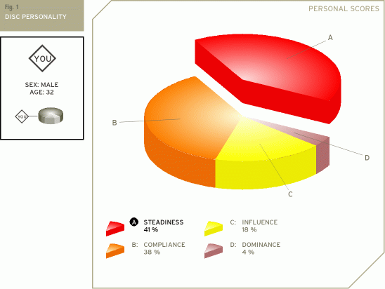
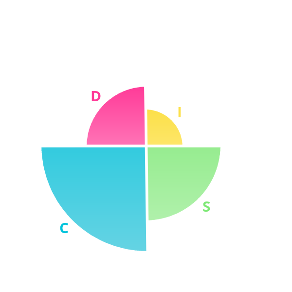
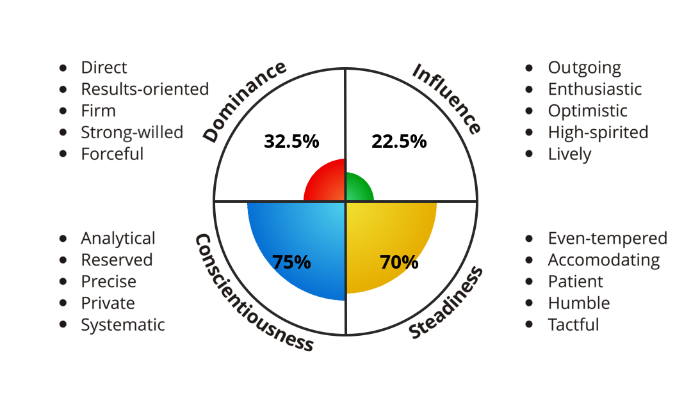

[123test.com](https://www.123test.com/disc-personality-test) - Your DISC Personality Report

# Result (2019)

## Introduction
Your specific distribution of scores on the DISC personality test is an indication of your unique personality. You can think of this as your DISC Personality 'DNA'. In the pie chart below you see your distribution of scores.

The highest percentage is likely to be your most dominant personality factor, the second highest your next most dominant personality factor and so on. As such for you the DISC factors are ordered as: Steadiness, Compliance, Influence, Dominance.

## DISC Personality Model
To help you understand the DISC model of personality here are definitions of the four factors measured.

### Dominance
Describes the way you deal with problems, assert yourself and control situations.
### Influence
Describes the way you deal with people, the way you communicate and relate to others.
### Steadiness
Describes your temperament - patience, persistence, and thoughtfulness
### Compliance
Describes how you approach and organize your activity, procedures and responsibilities.

## Your DISC personality type
Your unique sequence of scores characterizes you in a specific way. The positive impact you are likely to make on people is:

You are tenacious and determined to follow a course of action - to achieve objectives. You are a clear thinker. You have an inner need to be objective and analytical. You like to pursue a definite course of action. You respond to logic rather than emotion. You are likely to be particularly good at handling challenging technical assignments.
## DISC Patterns or Profiles
As you will appreciate, there are literally thousands of different combinations of scores. Therefore to help interpretation, communication and understanding, DISC Personality Model experts have defined - through statistical analysis of the score combinations - fifteen DISC 'Patterns' or 'Profiles'.

The 'Profiles' are often given names. The objective of these names is to give a single descriptive term that captures the essence of that Profile. Names often used are Achiever, Coach, Evaluator, Counselor, Creative, Individualist, Inspirational, Investigator, Objective Thinker, Perfectionist, Persuader, Practitioner, Enthusiast, Results-Oriented or Specialist

---

[Crystal](https://www.crystalknows.com/personality/) - DISC Test

## Result (2020)

You are the **Stabilizer**

### Traits
* Perceptive
* Calm
* Consistent

You tend to be logical and analytical about decisions, but warm in interactions with others.
You tend to prioritize stability and consistency in your environment. They are likely to be even-tempered, attentive to details, and structured in their approach. Even if a task may appear tedious, they can likely work through it patiently and correctly.

### Insights

#### What comes naturally to you

* Finishing one task before starting another
* Giving others time to adapt to change
* Appreciating formality in business meetings
* Listening closely to all the details

#### What energizes you

* Security
* Predictability
* Cleanliness & organization
* Support from others

#### What drains you

* Chaotic environments
* Uncertainty
* Vague directions
* Inconsistency from others

----

[IDRlabs](https://www.idrlabs.com/open-disc/test.php) - Open DISC Test

# Result (2021)

Your DISC Profile Is:

You are 50% D, 31.25% I, 62.5% S, 87.5% C.

## Explanation of Traits:
### (D)ominance
D-personalities are confident, opinionated, and assertive. They are comfortable taking charge and are often found in leadership positions. They find it natural to work at an arduous pace, delegate tasks, and give structure to the work of both themselves and others. D-personalities are decisive, objective, and achievement-oriented. They like to use language that is clear and efficient. Overall, they are assertive individuals who thrive on challenge and do not shy away from competition.

### (I)nfluence
I-personalities are inspiring, outgoing, and exciting to be around. They thrive in social interactions, seeing every interaction as the potential for a “win-win” situation. I-personalities are enthusiastic and optimistic, and will often use their social skills to generate optimism and motivation in others. They are open and approachable, creating a shared sense of purpose. It is through their natural charisma and people skills that I-personalities achieve success in work as well as in life.

### (S)teadiness
S-personalities are gentle, calm, and unwavering. There is usually a reassuring quality to their actions and words. Even in challenging circumstances, they tend to remain respectful and empathize with the perspectives of others. Loyal and supportive, S-personalities are usually excellent collaborators and team players who do not mind sharing the credit with others. In general, S-personalities tend to prefer the sure and steady approach over fads and quick gains.

### (C)onscientiousness
C-personalities are structured, purposeful, and systematic. Prizing structure and the methodical approach, C-personalities tend to excel in independent and specialist positions where they can drill down and allow their analytical temperament to flourish. Overall, C-personalities are reserved individuals who place a premium on careful decision-making. They have high standards and have usually done a great deal of research to make sure that what they say is accurate and correct.

----

[IDRlabs](https://www.idrlabs.com/disc/test.php) - DISC Test (Classic Version)

# Result (2021)

Your DISC Profile Is:

## Explanation of Traits:

### D-Personality
D-personalities are confident, opinionated, and assertive. They are comfortable taking charge and are often found in leadership positions. They find it natural to enforce an arduous pace, delegate tasks, and give structure to the work of both themselves and others. They often enjoy a challenge and are not known to shy away from difficult projects where they have to operate under pressure. D-personalities are decisive, objective, and achievement-oriented. They think of themselves as objective and try not to be overly influenced by emotional considerations or personal relationships. Their communication style is upfront and straightforward, using language that is clear, direct, and efficient. Overall, Ds are assertive, task-focused individuals who thrive on challenge and do not shy away from competition.

### I-Personality
I-personalities are inspiring, outgoing, and exciting to be around. They aim to thrive in social interactions, seeing every interaction as the potential for a “win-win” situation. With their charm and personal skills, I-personalities may easily become the center of attention, but they also strive to use their way with people to be inclusive and make others feel at ease. I-personalities are inspiring and optimistic, and will often use their social skills to generate optimism and motivation in others. They genuinely value networking and the process of getting to know others. I-personalities are open and approachable, charming those around them and bringing people together to create a shared sense of purpose. It is through this natural charisma that I-personalities achieve success in work as well as in life.

### S-Personality
S-personalities are gentle, calm, and unwavering. There is usually a reassuring quality to their actions and words, and they rarely get agitated or mad. Even in challenging circumstances, they tend to remain respectful and empathize with the perspectives of others. Loyal and supportive, S-personalities are usually excellent collaborators and team players who do not mind sharing the credit with others. Their somewhat reserved demeanor can sometimes be misinterpreted as unfriendliness, but this is generally because they need time to adapt to new people and situations. The communication style of S-personalities is usually warm and soft-spoken, with a focus on sharing personal stories as a way of building trust and rapport. In general, S-personalities tend to prefer the sure and steady approach over fads and quick gains.

### C-Personality
C-personalities are structured, purposeful, and systematic. Accuracy and order are extremely important to their way of making decisions. Prizing structure and the methodical approach, C-personalities tend to excel in independent and specialist positions where they can drill down and allow their analytical temperament to flourish. When a decision is important to them, they take pride in knowing that every fact has been examined and that all given circumstances have been analyzed using reason and logic. For the same reason, C-personalities tend to dislike broad generalizations with few specifics, preferring a communication style that is factual and serious in nature, and which is backed up by precise details and facts. Overall, C-personalities are reserved individuals who place a premium on careful decision-making. They have high standards and have usually done a great deal of research to make sure that what they say is accurate and correct.

----

[mydiscprofile](https://www.mydiscprofile.com/) - Personality Report

# Result (2021)

Your Personality Type is: **INTERPRETER**

**Pace:** Deliberate
**Perspective:** Detail 
**Focus:** Balanced

You are an *Interpreter*, a person who likes to take time to think about situations. You won't rush into action, but will spend time analysing the way things work, and discussing options with those around you. You tend to be open-minded and objective in your attitudes, meaning that you are often well-placed to help moderate disagreements between other people.

## About You
Caution, thoughtfulness, stability and accuracy are all words that describe your general personality style. You like to take time to understand a situation, and you'll rarely act until you feel fully informed. You're not a natural risk-taker, and for that reason you prefer to live and work in a relatively regular and predictable set of conditions.

## Your Most Important Values
What are your most important values?
You're a person who looks for regularity in your life and work, and you prefer events to move in a predictable pattern. Your approach is methodical and structured, and you look for the same levels of personal organisation in those around you.

## Your Key Personality Factors
* Hesitant
* Reserved
* Consistent
* Arbitrator
* Patient
* Reticent
* Cooperative
* Brusque
* Conscientious
* Undemonstrative

## Full report
[full report here (PDF)](mydiscprofile-report.pdf)
