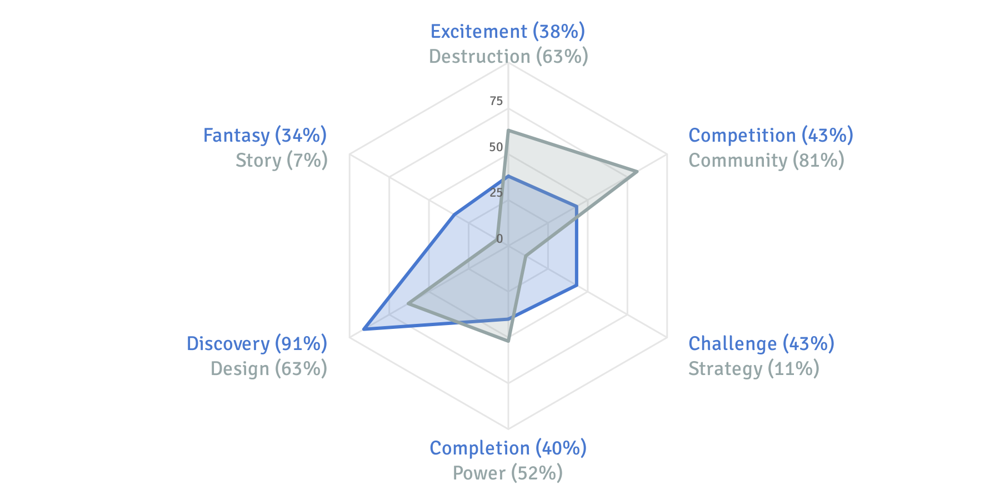

[Quantic Foundry](https://goo.gl/4Ld5PN) - Gamer Motivation Profile

## Spontaneous, Social, Grounded, and Creative
Your profile consists of your percentile rank across a broad range of gaming motivations. Your scores are based on how strong your motivations are relative to other gamers. In this customized report, we’ll explain how to interpret these scores and what motivations we measured.

#### Primary motivations

#### Secondary motivations

### The 6 Motivation Groups
We identified 6 clusters of motivations. In general, motivations within the same cluster tend to be positively correlated, while motivations between clusters tend to be statistically unrelated. We’ll walk you through the individual motivations in the section below.

### A Quick Word on Percentiles
Percentiles are how you rank relative to other people. In this report, your percentiles are how you compared with other gamers who have participated in this profile tool. A percentile of 80% means you scored higher than 80% of gamers. Conversely, a percentile of 10% means 90% of gamers had a higher score than you. This means that a 50% is perfectly average.
> Most people will have high scores on a few motivations, low scores on another few motivations, and the majority of their remaining scores will fall near the average (in the 35%-65% range). Thus, it’s your non-average scores that most define your profile as a gamer.

> Keep in mind that this isn’t a competition or an exam. High scores are not “better”. Gamers with extreme motivations (on both the low and high end) represent a smaller proportion of gamers and may have a harder time being satisfied by available games (which try to capture more average gamers within their genres).

### The Action Components (52%)
Gamers with high Action scores are aggressive and like to jump in the fray and be surrounded by dramatic visuals and effects. Gamers with low Action scores prefer slower-paced games with calmer settings.

**Destruction (63%):** Gamers who score high on this component are agents of chaos and destruction. They love having many tools at their disposal to blow things up and cause relentless mayhem. They enjoy games with lots of guns and explosives. They gravitate towards titles like Call of Duty and Battlefield. And if they accidentally find themselves in games like The Sims, they are the ones who figure out innovative ways to get their Sims killed.

**Excitement (38%):** Gamers who score high on this component enjoy games that are fast-paced, intense, and provide a constant adrenaline rush. They want to be surprised. They want gameplay that is full of action and thrills, and rewards them for rapid reaction times. While this style of gameplay can be found in first-person shooters like Halo, it can also be found in games like Street Fighter and Injustice, as well as energetic platformers like BIT.TRIP RUNNER.

> In our data from over 100,000 gamers, these are the most frequently mentioned games from gamers who score high on Destruction and Excitement:

> * Excitement: Super Smash Bros. Melee, Battlefield Series/3/4, Counter Strike, Call of Duty, God of War, Destiny, Kingdom Hearts 2, Resident Evil, League of Legends
> * Destruction: GTA Series/V, Battlefield Series/3/4, Destiny, Call of Duty, Gears of War, Halo, Borderlands Series/2, Doom, God of War, Counter Strike

### The Social Components (65%)
Gamers with high Social scores enjoy interacting with other players, often regardless of whether they are collaborating or competing with them. Gamers with low Social scores prefer solo gaming experiences where they can be independent.

**Competition (43%):** Gamers who score high on this component enjoy competing with other players, often in duels, matches, or team-vs-team scenarios. Competitive gameplay can be found in titles like Starcraft, League of Legends, or the PvP Battlegrounds in World of Warcraft. But competition isn’t always overtly combative; competitive players may care about being acknowledged as the best healer in a guild, or having a high ranking/level on a Facebook farming game relative to their friends.

**Community (81%):** Gamers who score high on Community enjoy socializing and collaborating with other people while gaming. They like chatting and grouping up with other players. This might be playing Portal 2 with a friend, playing Mario Kart at a party, or being part of a large guild/clan in an online game. They enjoy being part of a team working towards a common goal. For them, games are an integral part of maintaining their social network.

> In our data from over 100,000 gamers, these are the most frequently mentioned games from gamers who score high on Competition and Community:

> * Competition: Counter Strike Series/GO, Super Smash Bros. Melee, DoTA Series/2, League of Legends, Street Fighter, Heroes of the Storm, Starcraft 2, Call of Duty, Battlefield Series/3/4, FIFA
> * Community: Final Fantasy XIV, Battlefield Series/4, Destiny, Guild Wars Series/2, EverQuest, League of Legends, Monster Hunter, World of Warcraft, Counter Strike, DoTA Series/2

### The Mastery Components (21%)
Gamers with high Mastery scores like challenging gaming experiences with strategic depth and complexity. Gamers with low Mastery scores enjoy being spontaneous in games and prefer games that are accessible and forgiving when mistakes are made.

**Challenge (43%):** Gamers who score high on Challenge enjoy playing games that rely heavily on skill and ability. They are persistent and take the time to practice and hone their gameplay so they can take on the most difficult missions and bosses that the game can offer. These gamers play at the highest difficulty settings and don’t mind failing missions repeatedly in games like Dark Souls because they know it’s the only way they’ll master the game. They want gameplay thatconstantly challenges them.

**Strategy (11%):** Gamers who score high on this component enjoy games that require careful decision-making and planning. They like to think through their options and likely outcomes. These may be decisions related to balancing resources and competing goals, managing foreign diplomacy, or finding optimal long-term strategies. They tend to enjoy both the tactical combat in games like XCOM or Fire Emblem, as well as seeing their carefully-devised plans come to fruition in games like Civilization, Cities: Skylines, or Europa Universalis.

> In our data from over 100,000 gamers, these are the most frequently mentioned games from gamers who score high on Challenge and Strategy:

> * Challenge: Super Smash Bros. Melee, Devil May Cry 3, World of Warcraft, Dark Souls, Counter Strike, Street Fighter, Monster Hunter, DoTA Series/2, Starcraft 2, Warcraft 3
> * Strategy: Europa Universalis 4, Crusader Kings 2, Civilization Series/5, EVE Online, XCOM, Starcaft Series/2, Fire Emblem, Age of Empires, Warcraft 3, Kerbal Space Program

### The Achievement Components (46%)
Gamers with high Achievement scores are driven to accrue power, rare items, and collectibles, even if this means grinding for a while. Gamers with low Achievement scores have a relaxed attitude towards in-game achievements and don’t worry too much about their scores or progress in the game.

**Completion (40%):** Gamers with high Completion scores want to finish everything the game has to offer. They try to complete every mission, find every collectible, and discover every hidden location. For some players, this may mean completing every listed achievement or unlocking every possible character/move in a game. For gamers who score high on Design, this may mean collecting costumes and mounts in games like World of Warcraft.

**Power (52%):** Gamers who score high on this component strive for power in the context of the game world. They want to become as powerful as possible, seeking out the tools and equipment needed to make this happen. In RPGs and action games, this may mean maxing stats or acquiring the most powerful weapons or artifacts. Power and Completion often go hand in hand, but some players enjoy collecting cosmetic items without caring about power, and some players prefer attaining power through strategic optimization rather than grinding.

> In our data from over 100,000 gamers, these are the most frequently mentioned games from gamers who score high on Completion and Power:

> * Completion: Final Fantasy Series/IX, Assassin’s Creed Series, Legend of Zelda Series, God of War, Animal Crossing, Elder Scrolls Series, Destiny, Pokemon, Guild Wars 2, Fire Emblem
> * Power: World of Warcraft, Diablo 2/3, DoTA Series/2, Runescape, Destiny, Call of Duty, League of Legends, Counter Strike, God of War, Resident Evil

### The Creativity Components (81%)
Gamers with high Creativity scores are constantly experimenting with their game worlds and tailoring them with their own designs and customizations. Gamers with low Creativity scores are more practical in their gaming style and accept their game worlds as they are.

**Discovery (91%):** Gamers who score high on Discovery are constantly asking “What if?” For them, game worlds are fascinating contraptions to open up and tinker with. In an MMO, they might swim out to the edge of the ocean to see what happens. In MineCraft, they might experiment with whether crafting outcomes differ by the time of day or proximity to zombies. They “play” games in the broadest sense of the word, often in ways not intended or imagined by the game’s developers.

**Design (63%):** Gamers who score high on this component want to actively express their individuality in the game worlds they find themselves in. In games like Mass Effect, they put a lot of time and effort in the character creation process. In city-building games or space strategy games, they take the time to design and customize exactly how their city or spaceships look. To this end, they prefer games that provide the tools and assets necessary to make this possible and easy to do.

> In our data from over 100,000 gamers, these are the most frequently mentioned games from gamers who score high on Discovery and Design:

> * Discovery: Elder Scrolls Series (Oblivion/Morrowind/Skyrim), Fallout Series/3/New Vegas, Fable, Legend of Zelda Series/Ocarina of Time, GTA Series/V, Minecraft, Earthbound, Kerbal Space Program, Metal Gear Solid 3, Metroid Prime
> * Design: The Sims Series, City of Heroes, Animal Crossing, Guild Wars 2, Final Fantasy XIV, Dragon Age Series/Origins, Mass Effect Series, Monster Hunter, Pokemon, Elder Scrolls Series/Oblivion/Skyrim

### The Immersion Components (14%)
Gamers with high Immersion scores want games with interesting narratives, characters, and settings so they can be deeply immersed in the alternate worlds created by games. Gamers with low Immersion scores are more grounded in the gameplay mechanics and care less about the narrative experiences that games offer.

**Fantasy (34%):** Gamers who score high on Fantasy want their gaming experiences to allow them to become someone else, somewhere else. They enjoy the sense of being immersed in an alter ego in a believable alternate world, and enjoy exploring a game world just for the sake of exploring it. These gamers enjoy games like Skyrim, Fallout, and Mass Effect for their fully imagined alternate settings.

**Story (7%):** Gamers who score high on Story want games with elaborate campaign storylines and a cast of multidimensional characters with interesting back-stories and personalities. They take the time to delve into the back-stories of characters in games like Dragon Age and Mass Effect, and enjoy the elaborate and thoughtful narratives in games like The Last of Us and BioShock. Gamers who score low on Story tend to find dialogue and quest descriptions to be distracting and skip through them if possible.

> In our data from over 100,000 gamers, these are the most frequently mentioned games from gamers who score high on Fantasy and Story:

> * Fantasy: Dragon Age Series/Inquisition/Origins, Elder Scrolls Series/Morrowind, Dishonored, Mass Effect Series/2/3, Skyrim, Fable, Fallout New Vegas, Knights of the Old Republic, Journey, Legend of Zelda
> * Story: Dragon Age Series/Origins, Mass Effect Series/2/3, Persona 3/4, Tales of Symphonia, Xenogeras, Final Fantasy VIII/IX/X, Knights of the Old Republic, Fire Emblem, Kingdom Hearts Series/2, Planescape Torment

