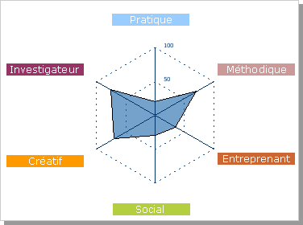

[Kledou](https://kledou.fr/) - :fr: [FR] Test d'orientation scolaire et professionnelle gratuit 

# Résultats du test de Morgan - Mardi 10 Juin 2008 

## Votre profil de personnalité

### Investigateur 75 %
Les personnes de ce type ont besoin d’étendre leurs connaissances en permanence. Elles aiment observer, rechercher de l’information, comprendre leur environnement et résoudre des problèmes. Elles se sentent à l’aise dans les activités nécessitant de la réflexion.
### Méthodique 70 %
Les personnes de ce type ont une préférence pour les activités méthodiques avec un objectif précis. Elles savent instruire des dossiers, mettre en œuvre des procédures, gérer des données chiffrées. Elles apprécient de travailler dans un environnement bien organisé.
### Créatif 70 %
Les personnes de ce type sont attirées par les domaines artistiques comme la littérature, la musique ou le dessin, mais elles se plaisent plus généralement dans tout domaine où leur créativité peut s’exprimer. D'esprit indépendant et non conformiste, elles sont à l'aise dans des situations qui sortent de l'ordinaire.
### Entreprenant 35 %
Les personnes de ce type aiment influencer leur entourage. Pour atteindre leurs objectifs, elles disposent d'une bonne capacité de décision et d'une habileté particulière à communiquer leur enthousiasme. Elles savent vendre des idées autant que des biens matériels. Elles font preuve d'audace et d'efficacité.
### Social 30 %
Les personnes de ce type aiment être en contact avec les autres dans le but de les aider, de les informer, de les éduquer, ou de les soigner. Elles s'intéressent aux comportements humains et sont soucieuses de la qualité de leurs relations avec les autres.
### Pratique 20 %
Les personnes de ce type exercent surtout des tâches concrètes. Elles sont habiles de leurs mains, se servent d'outils, ou encore font fonctionner des appareils ou des machines. Elles préfèrent exercer leur profession sur le terrain plutôt que dans un bureau.

## Nos propositions d'orientation
#### Les 3 secteurs d'activité qui vous correspondent le mieux
1. Arts - Culture - Spectacles 50 %
2. Sciences - Technologie - Informatique 47 %
3. Gestion - Administration - Finances 45 %

## Les 20 métiers qui se rapprochent le plus de votre profil
1. Développeur multimédia (Bac +4) : 100%
2. Préparateur / Préparatrice correcteur (presse / édition) (Bac) : 100%
3. Secrétaire de rédaction (Bac +3) : 100%
4. Traducteur / Traductrice technique (Bac +4) : 100%
5. Dessinateur modéliste (habillement) (Bac +2) : 97%
6. Traducteur / Traductrice d'édition (Bac +4) : 97%
7. Actuaire (Bac +5) : 70%
8. Administrateur de base de données (Bac +3) : 70%
9. Analyste programmeur (Bac +2) : 70%
10. Architecte (Bac +5) : 70%
11. Chargé(e) de recrutement (Bac +4) : 70%
12. Conservateur d'archives (Bac +7) : 70%
13. Conservateur de bibliothèque (Bac +5) : 70%
14. Contrôleur de la concurrence et de la consommation (Bac) : 70%
15. Critique (Bac +3) : 70%
16. Designer industriel (Bac +4) : 70%
17. Inspecteur / Inspectrice de la répression des fraudes (Bac +5) : 70%
18. Inspecteur / Inspectrice des douanes (Bac +4) : 70%
19. Inspecteur / Inspectrice des impôts (Bac +3) : 70%
20. Inspecteur / Inspectrice du trésor public (Bac +3) : 70%

## Votre bilan détaillé par secteur d'activité
### Arts - Culture - Spectacles 50 %
* Préparateur / Préparatrice correcteur (presse / édition) (Bac) : 100%
* Dessinateur modéliste (habillement) (Bac +2) : 97%
* Traducteur / Traductrice d'édition (Bac +4) : 97%
* Critique (Bac +3) : 70%
* Designer industriel (Bac +4) : 70%

### Gestion - Administration - Finances 45 %
* Conservateur d'archives (Bac +7) : 70%
* Conservateur de bibliothèque (Bac +5) : 70%
* Inspecteur / Inspectrice des impôts (Bac +3) : 70%
* Inspecteur / Inspectrice du trésor public (Bac +3) : 70%

### Vente - Communication - Publicité 41 %
* Secrétaire de rédaction (Bac +3) : 100%
* Journaliste (Bac +3) : 70%

### Justice - Police - Armée 36 %
* Contrôleur de la concurrence et de la consommation (Bac) : 70%
* Inspecteur / Inspectrice de la répression des fraudes (Bac +5) : 70%
* Inspecteur / Inspectrice des douanes (Bac +4) : 70%

### Industrie - Transport 34 %
* Navigateur timonier (Marine Nationale) (BEP/CAP) : 70%

### Métiers manuels ou techniques 32 %
* Aucun métier ne vous correspond dans ce secteur

### Médecine - Santé 32 %
* Aucun métier ne vous correspond dans ce secteur

### Métiers de plein air 30 %
* Paysagiste conseil (Bac +5) : 70%

### Action sociale - Emploi 30 %
* Aucun métier ne vous correspond dans ce secteur

### Services à la personne et aux entreprises 28 %
* Traducteur / Traductrice technique (Bac +4) : 100%
* Chargé(e) de recrutement (Bac +4) : 70%

### Enseignement - Formation 27 %
* Aucun métier ne vous correspond dans ce secteur

### Commerce 24 %
* Aucun métier ne vous correspond dans ce secteur

### Sports - Loisirs 18 %
* Journaliste sportif (Bac) : 70%

