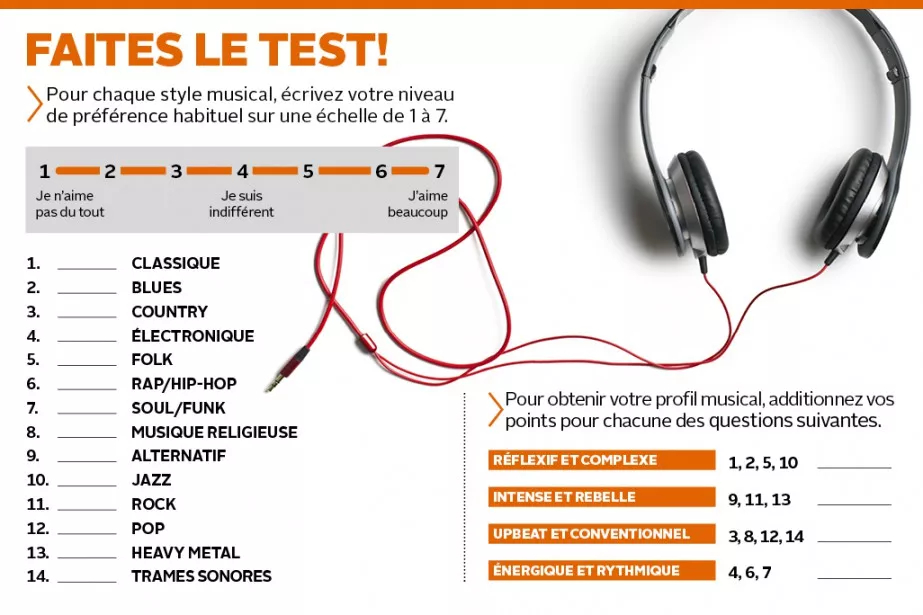

[Marc Allard](https://www.lesoleil.com/chroniques/marc-allard/nous-sommes-ce-que-nous-ecoutons-d94815457194e1d6b1c9817df03fa1f6) - :fr: [FR] Nous sommes ce que nous écoutons

> Les psychologues Peter Rentfrow, de l'Université de Cambridge, en Angleterre, et Samuel D. Gosling, de l'Université du Texas, ont interrogé plus de 3000 personnes dans plusieurs pays occidentaux pour arriver à cette conclusion. 
> Ils ont d'abord mis sur pied un test pour déterminer ce que vous aimez mieux écouter.

# My results:

1. 5
2. 5
3. 4
4. 5
5. 4
6. 3
7. 4
8. 1
9. 5
10. 3
11. 7
12. 4
13. 7
14. 4

* 9+11+13 = **19 (intense & rebelle)** 
* 1+2+5+10 = **17 (réflexif et complexe)**
* 3+8+12+14 = 13 (upbeat et conventionnel)
* 4+6+7 = 12 (énergique et rythmique)

* Les fans de musique intense et rebelle aiment prendre des risques, sont plus curieux, actifs physiquement et verbalement agiles que la moyenne, et ils se trouvent intelligents. Et même si cette catégorie de musique met davantage l'accent sur les émotions négatives, ses adeptes ne sont pas plus névrosés ou désagréables que les autres.
* Les adeptes de musique réflexive et complexe tendent à être plus ouverts à l'expérience, inventifs et tolérants envers les autres. Ils valorisent les expériences esthétiques, se considèrent intelligents, ont de bonnes habiletés verbales (mais pas analytiques) et rejettent les idées conservatrices.
* Quant aux amateurs de musique upbeat et conventionnelle, ils sont plus extravertis, aimables, conservateurs et consciencieux. Ils aiment aider les autres, sont plus actifs physiquement et se trouvent beaux. 
* Enfin, les amateurs de musique énergique et rythmique ont tendance à être plein d'énergie, plus extravertis et aimables. Ils pardonnent facilement, parlent beaucoup, se trouvent beaux eux aussi et ne peuvent pas blairer les idées conservatrices.  

See also: Rentfrow PJ, Gosling SD. The do re mi's of everyday life: The structure and personality correlates of music preferences. Journal of Personality and Social Psychology. 2003; 84: 1236-1256.
