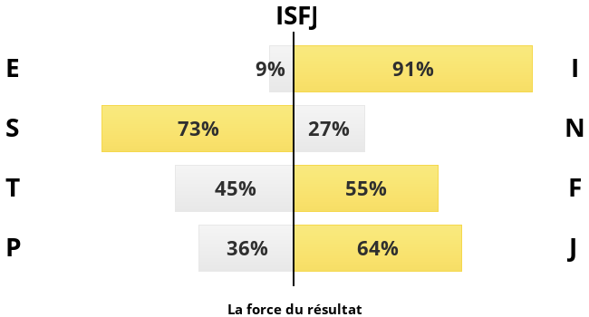

[my-personality-test.com](https://my-personality-test.com/) - Personality Type Indicator

## Result (2020)
**INTJ The Visionaries**

### 46% INTROVERTED
Thought oriented, Reserved, Reflective, Observant
### 8% INTUITIVE
Imaginative, Future oriented, Conceptual, Abstract
### 17% THINKING
Logical, Reasonable, Level headed, Values fairness
### 4% JUDGING
Organised, Systematic, Achievement oriented, Planner

## INTJ Characteristics
INTJs make up 2.9% of the population.

* Strategic, and goal-oriented – great at solving problems
* Able to see the “big picture” and consider large theoretical ideas
* Independent, innovative, and resourceful
* Very insightful and intuitive, and make many decisions based off of this
* Natural leaders, but are also willing to be followers if they trust the person in charge
* Adaptable, and are bored by repetition and routine
* Calm and analytical

----

[Source](https://www.truity.com/personality-type/ISFP/careers)

### Top careers for the ISFP include:

* Fashion Designer
* Interior Designer
* Cosmetologist
* Artist
* Landscape Architect
* Jeweler
* Carpenter
* Chef
* Tailor
* Graphic Designer
* Mechanic
* Forester
* Surveyor
* Gardener
* Florist
* Nurse
* Massage Therapist
* Occupational Therapist
* Veterinary Assistant
* Dental Hygienist
* Physical Therapist
* Fitness Trainer
* Optician
* ER Physician
* Physician Assistant
* Dietitian
* Pharmacist
* Office Manager
* Paralegal
* Insurance Appraiser
* Botanist
* Geologist
* Preschool Teacher
* Social Worker
* Translator
* Special Education Teacher
* Teacher's Aide
* Air Traffic Controller
* Police Officer
* Firefighter
* Residential Counselor
* Animal Trainer
* Retail Manager
* Recreation Worker
* Bookkeeper

### ISFP Careers to Avoid
It is important to note that any personality type can be successful in any occupation. However, some occupations are well suited to the natural talents and preferred work style of the ISFP, while other occupations demand modes of thinking and behavior that do not come as naturally to the ISFP. Occupations that require the ISFP to operate outside their natural preferences may prove stressful or draining, and often sound unappealing to ISFPs who are choosing a career.

The following occupations have been found to be unpopular among ISFPs, based on data gathered from surveys of the general population.

* Executive
* Sales Manager
* Marketing Manager
* Retail Salesperson
* Auditor
* School Administrator
* Surgeon
* Dentist
* Psychiatrist
* Health Care Administrator
* Biomedical Engineer
* Biologist
* Aeronautical Engineer
* Chemical Engineer
* Attorney
* Judge
* Actor
* Architect

### The ISFP on a Team
ISFPs are sensitive, helpful team members who look for opportunities to contribute in an immediate, practical way. They want to assist other people and provide support, and often take on the role of listener. Oriented to cooperation, the ISFP will look for ways to compromise and accommodate others. They tend to step in when others need help and are often prepared with specific, relevant data that can help the team understand the facts of the situation.

ISFPs are at their best when they can work with others in a supportive, action-oriented role. They excel at creatively solving problems to meet people’s immediate needs. ISFPs shy away from theory and future projections, and may become impatient with ideas that have no concrete benefit for people. ISFPs are characteristically unassuming, and may be reluctant to advocate strongly for their own perspective on a team. They can become frustrated with team members who are domineering or competitive, and do best on a caring, egalitarian team where everyone’s contribution is appreciated.

### The ISFP as a Leader
In leadership positions, ISFPs are driven by a personal mission and interested in helping their teams cooperate to accomplish realistic goals. Their strengths lie in understanding the needs and concerns of the people they work with and adapting gracefully to changing circumstances. ISFP leaders are practical and down-to-earth, good at sizing up resources and assessing the requirements of the current situation. They are good at building trust and leading by example, preferring to be quietly supportive rather than authoritarian or domineering.

ISFPs often prefer not to be in a leadership role, but are sometimes motivated to take the lead when the project is personally significant to them. When they do lead, they do best heading a small, cooperative team to achieve practical and tangible results.

----

[IDRlabs](https://www.idrlabs.com/test.php) - personality type test (2021)

## Description :fr:

Fiable, bienveillant et loyal à ceux qui vous sont proches, vous avez une excellente compréhension des réalités factuelles qui vous entourent, ainsi qu’une attention aux détails, chacune de ces qualités vous poussant à vous rapprocher naturellement des autres et de leurs besoins émotionnels. Bienfaisant et attentif, vous avez tendance à assumer rapidement vos responsabilités et à aider les autres dès que vous déterminez qu’une tâche pourrait leur servir. Même si votre entourage n’en est pas vraiment conscient, vous avez tendance à prendre en charge beaucoup de responsabilités. Malgré cela, ce n’est souvent qu’en votre absence que les autres remarquent l’immense contribution que vous apportez habituellement afin de vous assurer que tout fonctionne parfaitement autour de vous et que tout un chacun est pris en considération et se sent à l'aise. Consciencieux, rigoureux, et peut-être un peu perfectionniste, vous n’êtes pas du genre à courir impulsivement après des perspectives incertaines, sans avoir d’abord terminé les efforts requis. Vous avez tendance à trouver une grande satisfaction dans le travail acharné vers l’atteinte de vos buts et dans le soutien inconditionnel aux autres, démontrant ainsi votre souci des autres par vos actions et préférant guider par votre exemple calme et digne.

## Description - Basic portrait #1

*"We need to be organized to work together. A readiness to cooperate is one of the factors that give us all hope."*

### ISFJs at a Glance
* Quiet, cordial, and conscientious.
* Nurturing, patient, and considerate.
* Humble and understated cooperators, who prefer to let the facts speak for themselves.
* Intent on kindness and cooperation, showing respect for other people's feelings and views.
* Draw on an inner world of rich nonverbal impressions, frequently "just knowing" that something is right.

### ISFJs as They Typically Are
ISFJs are warm and reassuring individuals who facilitate cooperation between people and appeal to what is best in others. While their outer lives are usually focused on kindness, considerate action, and the welfare of others, the inner life of an ISFJ tends to revolve around a private repository of deeply-internalized personal experience and rich nonverbal impressions. It is through this combination of inner and outer processes that the ISFJ develops their unique and commendable strengths of civility, conscientiousness, and a practical respect for the facts.

ISFJs tend to place an emphasis on kindness in their everyday lives. They tend to be sensitive and alert to division and discord amongst those close to them, which they feel especially strongly, and ISFJs are often willing to go to great lengths to heal the rifts in their community. When engaged in the peacekeeper mode, an ISFJ will put a considerable amount of effort, and perhaps even a jot of self-sacrifice, into reaching the goal of social conciliation and harmony in their environment. And more often than not, the ISFJ will undertake these labors without expecting others to do the same in return.

As a consequence of their valiant efforts, others tend to appreciate the ISFJ, not just for the friendliness of their character, but also for the warmth and safety of the environment they provide. And for their part, ISFJs also tend to experience a sense of fulfillment at seeing the fruits of their labor: A harmonious and well-functioning social environment marked by human flourishing and people making the most of their individual qualities and gifts - qualities that might never have emerged if not for the ISFJ's efforts to prepare the ground with their thoughtfulness and consideration. In both their private and professional lives, ISFJs tend to enjoy helping others and seeing them flourish as a consequence of the kindness, assistance, and opportunity that was extended to them.

Because ISFJs tend to seem unassuming and approachable, and because they tend to be quick to align their own interests with those of others, people may sometimes think that they have figured out the ISFJ and that they know what makes them tick. In reality, however, this is unlikely to be correct: In their inner lives, ISFJs are governed by a private repository of personal impressions and experiences that remain unshared with others. With them, impressions register especially deeply and, of all the types, the ISFJ is perhaps the type that listens to these inner impressions the most. This inner receptivity allows the ISFJ to experience the world in a highly aesthetic and impressionistic style. For example, an ISFJ may be walking down the street and suddenly be overwhelmed by the deep symbolic meaning of even everyday objects (such as a flower in a shop window), or they may laugh very hard at something that others do not necessarily see the humor in. It is also this impressionistic mode of perception that gives many an ISFJ a sort of "sixth sense" about other people, allowing them, for example, to "just know" what they think about the trustworthiness or moral character of someone they have just met.

These personalized impressions are, however, exceedingly hard (if not impossible) to translate from the medium of the original impression into the type of sustained verbal argument that is often demanded as a means of justification in contemporary society. For this reason, and because the ISFJ is not wont to be overstated or confrontational, others may find it easy to dismiss or devalue the input of the ISFJ. Unfortunately, the types that are the most likely to dismiss the ISFJ's input out of hand are also precisely the types that tend to be the most unreceptive to the kind of observations that form the basis of the ISFJ's reasoning. Hence they dismiss the input of the ISFJ at their own peril, and in doing so, their analysis will become all the more one-sided for it.

With their warmth, kindness, and seriousness of purpose, the presence of an ISFJ is likely to be a boon to almost any group, organization, or social setting. They are compassionate and devoted, and often blessed with great realism and follow-through. Though others are not always aware of it, ISFJs are also frequently good at foretelling the practicality of a plan or the inner moral character of someone they have just met. While they may sometimes be thought remote or reserved by people who do not know them too well, this facade is never one of indifference or coldness, but rather of earnestness and serious attention to the task at hand. With their care and consideration, and preference for leading by example, rather than by ornate speeches, ISFJs are truly among the most quiet and understated heroes of our world.

## Description - Basic portrait #2

*"The small individual contributors of caring, friendship, forgiveness, and love from each of us can form a phalanx, an army, with great capability."*

### ISFJs as They Typically Are
Warm-hearted and congenial, ISFJs are quiet - and sometimes overlooked - individuals who genuinely like getting to know other people and helping them. They often enjoy conversing with others and learning all the details of their lives, such as who they are, who they are married to, where they work, whether they have children, and where they grew up. They tend to be very accepting and forgiving of people and they like to get a firm grasp of the identities of others, so that they have a solid idea of what the person is like. They tend to easily pick up on the emotional states of others and are often quite skilled at soothing them and smoothing over awkward situations.

ISFJs generally carry themselves with a sense of social etiquette. Often they will seem to know exactly how to act in order to come across as friendly and constructive so that both parties will get the most out of the social situation.

In their personal lives, they tend to enjoy keeping an orderly environment where they can feel that they are in control. They can be somewhat fastidious at times, diligently spending long hours making sure that everything is just right and set up the way they like it. Forward-thinking, ISFJs are known to double-check things and carefully review information to make sure that they are on top of things, that they haven’t missed anything, and that no mistakes can be found in their work. Yet because they are not as one-sidedly object-focused as their ISTJ counterparts, but are intensely attuned to people as well, this can sometimes mean that they have a hard time reconciling their own high standards with the messiness of having to coordinate the different emotions, values, and approaches of the various people around them. They don't want to come down on anyone, but at the same time, they often see what could go wrong with a given arrangement before others do.

When encountering a new situation, or entering into a new workplace, ISFJs are usually respectful of authority and keep a low profile. To them, attaining mastery of something is a long and studious process, and they are not apt to set themselves up as big reformers or know-it-alls until they have made sure that they know all the intricacies of the situation at hand. They also generally prefer to stay in the background, leading through their example rather than through their words. When they do speak up, it is usually the result of a long process of thoughtful study whereby they have come to be absolutely sure that they know what they are talking about and after having ascertained for themselves that nobody else is going to step up to effect the desired improvements.

ISFJs tend to value social harmony. To them, solidarity and community are not merely values in themselves, but devices that help arrange the qualities of everyone involved so that the whole is stronger than the sum of its parts. As mentioned, ISFJs do not jump the gun as soon as they have seen that something could be improved. They attempt to factor in the wishes and feelings of others too, and at times, this can lead ISFJs to feel conflicted between asserting the better solutions they have seen on the one hand, and reaching out to accommodate the feelings of people on the other.

ISFJs tend to form strong and deep attachments to the people in their lives whom they consider especially important. They find strength in the bonds that they have created and these bonds are often a source of identity and pride for them. Consequently, ISFJs are often capable of great feats of loyalty and dedication whenever a person in their inner circle needs their help in some way.

They genuinely enjoy supporting others and with their talent for planning and organizing, they tend to make good managers and to excel in all types of roles that require them to use their combination of people skills and attention to detail in order to make sure that everything is running smoothly. While they do not like calling attention to themselves, or causing too much of a stir, they tend to be very focused on the requirements of the task at hand. Consequently, some ISFJs may end up in situations where they're really the glue holding everything together, but where other more blusterous natures are hogging the credit for their work.

ISFJs tend to pay great attention to detail and to hold a special regard for others who have proven themselves to be masters of what they do. While such mastery may sometimes seem mundane to others ("Well, of course he's good at his job, duh!"), ISFJs tend to hold a special appreciation for the fact that just because someone has a given position, that doesn't necessarily mean that they are managing that position conscientiously. In this way, the presence of an ISFJ is often a good litmus test of who is walking the walk and not just talking the talk, and many would do well to listen to their soft-spoken, yet carefully researched opinions.
