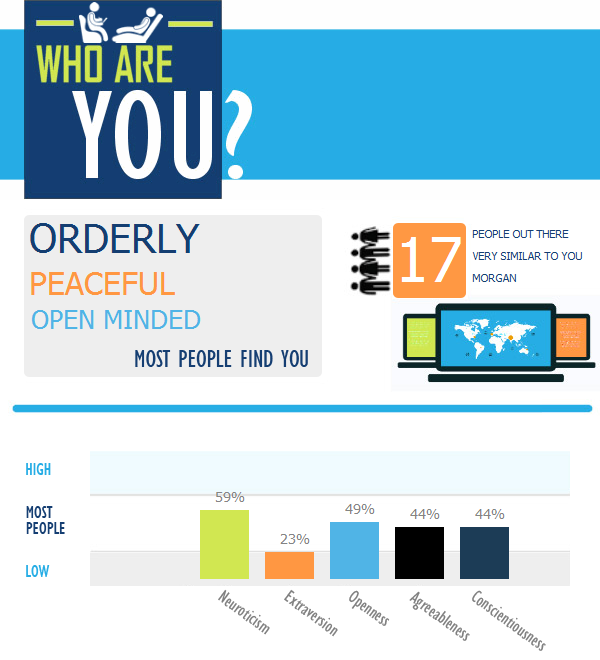
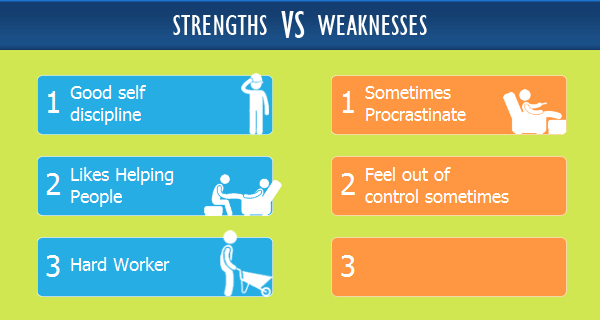
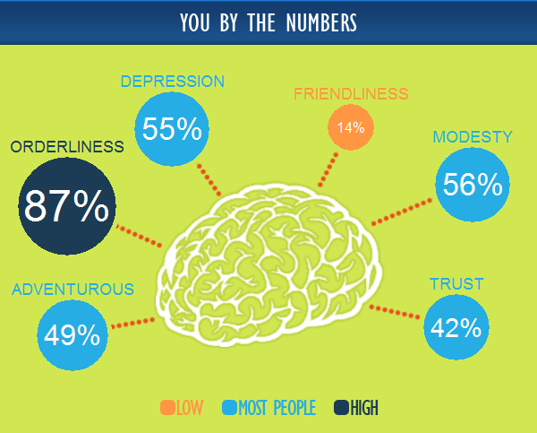
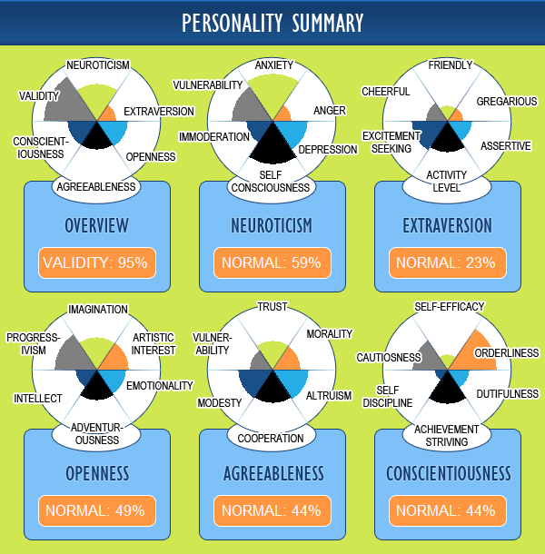

[See My Personality](https://www.seemypersonality.com/#q1) - Personality Test

## Result (2020)

### Personality Type
* Emotionally [B]alanced : 41% <--> Emotionally **[R]eactive** : 59%
* **[I]ntraverted** : 77% <--> [E]xtraverted : 23%
* **[C]onventional** : 51% <--> [O]pen : 49%
* **[G]uarded** : 56% <--> [A]greeable : 44%
* **[S]pontaneous** : 56% <--> [D]isciplined : 44%

#### Your Personality Type is The Artisan (RICGS)
Artisans are emotionally reactive, which means that they experience their emotions strongly and can be very passionate., however also have a higher tendency to experience emotions such as anxiety, anger and depression. Due to their independence and reserve, sometimes the Artisan can be perceived as arrogant or unfriendly, however this is merely because they don't require the same level of social stimulation or interaction that others may seek. The Artisan generally prefers fact over fiction and security and stability over ambiguity and disorder. Sticking with convention and familiar routines is generally best. With a healthy skepticism of the motives of others, and a belief in justice and being self made, sometimes the Artisan can come across as guarded or intimidating. However the Artisan has a refreshing impulsiveness about them, they tend to dislike too many rules and regulations and can be casual and whimsical.

13.65% of people are Artisans

## Big Five Overview

* Neuroticism : 59
* Extraversion : 23
* Openness to Experience : 49
* Agreeableness : 44
* Conscientiousness : 44

You rarely get angry and it takes a lot to make you angry, however you are sensitive about what others think of you. Your concern about rejection and ridicule cause you to feel shy and uncomfortable around others. You are easily embarrassed and often feel ashamed. Your fears that others will criticize or make fun of you are exaggerated and unrealistic, but your awkwardness and discomfort may make these fears a self-fulfilling prophecy. People generally perceive you as distant and reserved, and you do not usually reach out to others. You prefer dealing with either people or things rather than ideas. You regard intellectual exercises as a waste of your time. You will help others if they are in need. If people ask for too much of your time you feel that they are imposing on you, however you are not affected strongly by human suffering, priding yourself on making objective judgements based on reason. You are more concerned with truth and impartial justice than with mercy.

You are well-organized and like to live according to routines and schedules. Often you will keep lists and make plans.

## Neuroticism
* Overall Score : 59
* Anxiety : 81
* Anger : 21
* Depression : 55
* Self-Consciousness : 76
* Immoderation : 38
* Vulnerability : 69

## Extraversion
* Overall Score : 23
* Friendliness : 14
* Gregariousness : 15
* Assertiveness : 35
* Activity Level : 49
* Excitement-Seeking : 57
* Cheerfulness : 28

People generally perceive you as distant and reserved, and you do not usually reach out to others. You tend to feel overwhelmed by, and therefore actively avoid, large crowds. You often need privacy and time for yourself. You are an active group participant but usually prefer to let someone else be the group leader. You lead a moderately paced life. You like some energetic activities, but also like to relax and take it easy. You enjoy some excitment and risk taking in your life. You are not prone to spells of energetic high spirits.
You feel tense, jittery, and nervous and often feel like something dangerous is about to happen. You may be afraid of specific situations or be just generally fearful. You rarely get angry and it takes a lot to make you angry. Mostly your emotions are on an even keel and you do not get depressed easily. You are sensitive about what others think of you. Your concern about rejection and ridicule cause you to feel shy and uncomfortable around others. You are easily embarrassed and often feel ashamed. Your fears that others will criticize or make fun of you are exaggerated and unrealistic, but your awkwardness and discomfort may make these fears a self-fulfilling prophecy. You often resist any cravings or urges that you have, but sometimes you give in. You experience panic, confusion, and helplessness when under pressure or stress.

## Openness to Experience
* Overall Score : 49
* Imagination : 51
* Artistic Interests : 51
* Emotionality : 43
* Adventurousness : 49
* Intellect : 28
* Progressivism : 72

You are a moderately imaginative person who enjoys a good balance between the real world and fantasy. You are reasonably interested in the arts but are not totally absorbed by them. Generally you are not considered to be an emotional person, however you are aware of and in touch with your emotions. Familiar routines are good, but sometimes you like to spice up your life with a bit of adventure or activity. You prefer dealing with either people or things rather than ideas. You regard intellectual exercises as a waste of your time. Often you exhibit a readiness to challenge authority, convention, and traditional values. Sometimes you feel a certain degree of hostility toward rules and perhaps even enjoy ambiguity.

## Agreeableness
* Overall Score : * 44
* Trust : 42
* Morality : 40
* Altruism : 58
* Cooperation : 54
* Modesty : 56
* Sympathy : 31

You mostly assume that people are honest and fair, however you are wary and hold back from trusting people completely. There are times when you believe that a certain amount of deception in social relationships is necessary, however you are mostly candid, frank and sincere. People find it moderately easy to relate to you. You will help others if they are in need. If people ask for too much of your time you feel that they are imposing on you. You do not enjoy confrontation, but you will stand up for yourself or push your point if you feel it is important. You are willing to take credit for good things that you do but you don't often talk yourself up much. You are not affected strongly by human suffering, priding yourself on making objective judgements based on reason. You are more concerned with truth and impartial justice than with mercy.

## Conscientiousness
* Overall Score : 44
* Self-Efficacy : 13
* Orderliness : 87
* Dutifulness : 29
* Achievement-Striving : 57
* Self-Discipline : 10
* Cautiousness : 56

Often you do not feel effective, and may have a sense that you are not in control of your life. You are well-organized and like to live according to routines and schedules. Often you will keep lists and make plans. You find contracts, rules, and regulations overly confining and are sometimes seen as unreliable or even irresponsible by others. Mostly you work towards achieving your best, although in some areas you are content just to get the job done. You find yourself procrastinating and show poor follow-through on tasks. Often you fail to complete tasks - even tasks that you want very much to complete. You are not an overly cautious person. You will think about alternatives and consequences but make up your mind fairly quickly.

## Overview

## Strengths vs Weaknesses

## You by the Numbers

## Personality Summary

