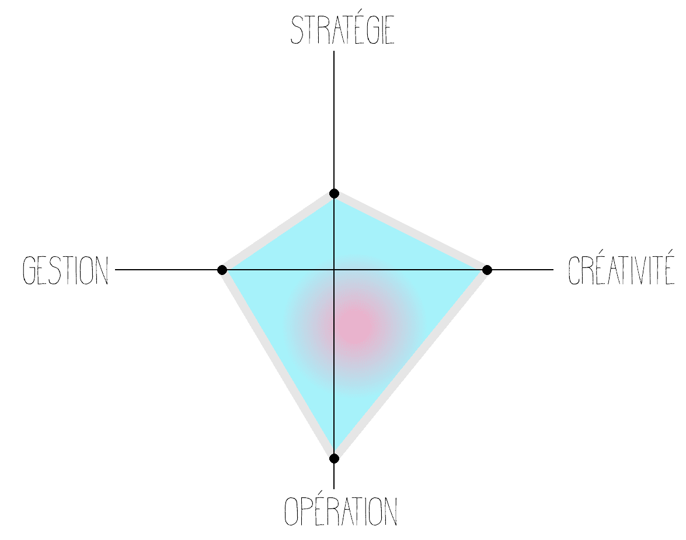

[WAKE UP](https://www.wake-up.io/boussole/) - :fr: [FR] Test Boussole | Test de personnalité pour trouver son talent d'or

### Présentation
Boussole est un test de personnalité basé sur les recherches en neurosciences ainsi que sur la mécanique de l'esprit décrite dans les travaux du célèbre psychologue Carl Gustav Jung. A travers ses questions, il analyse ainsi les dimensions conscientes et inconscientes de notre psychologie.

### Votre talent d'or

D’après vos réponses au questionnaire, votre talent d'or se caractériserait par votre capacité à favoriser l’harmonie et la stabilité. Vous savez créer des liens forts avec les personnes grâce à votre empathie et votre écoute attentive. On apprécie ainsi votre gentillesse, votre calme et votre volonté d’aider.

Votre fiabilité est également une grande force. On sait que si prenez en charge une tâche, alors elle sera rendue en temps et en heure et qu’aucun détail ne sera laissé au hasard. Vous prendrez le temps de vous informer précisément sur les tenants etles aboutissants du sujet. Puis, si vous rencontrez un problème, on pourra compter sur votre sens pratique aiguisé pour en venir à bout.

Si cette description vous semble plutôt naturelle, c’est une très bonne chose. Cela signifie qu’elle est pertinente et qu’il s’agit potentiellement de votre talent d’or. Maintenant, tout votre challenge est de prendre conscience que pour plus de 90 %de l’humanité, ces capacités ne sont pas du tout naturelles, ni évidentes.

La plupart des personnes n’ont pas une sensibilité et un pragmatisme autant développés que vous Morgan. Elles n’accordent pas autant d’importance à l’harmonie et à l’efficacité dans le travail. Affirmez donc fièrement qui vous êtes.

En entreprise, vous êtes celui qui fait en sorte que le travail soit productif et qu’il tienne compte du bien-être de chacun. Pour ce faire, les choses doivent s’exécuter l’une après l’autre et en prévenant suffisamment à l’avance. Dans ce contexte, vous pouvez libérer une énergie et un enthousiasme qui sont tout à fait fédérateurs dans votre équipe. Vous arrivez alors valoriser les talents de chacun et à vous faire apprécier en tant que leader.

En revanche, vous êtes sans doute moins à l’aise avec l’incertitude, l’abstraction et les conflits. Ces trois éléments font pourtant partie de la vie de toute entreprise. Mais ce n’est pas un problème car vous pouvez vous entourer de personnes particulièrement stratèges et visionnaires qui savent aller spontanément à la rencontre de l’inconnu. Ce type de binôme est très harmonieux car votre esprit terre-à-terre complète très bien les esprits créatifs. À condition néanmoins de bien reconnaître leur valeur.

Concrètement, vous devriez vous orienter vers des métiers qui visent à favoriser l’harmonie collective et le bien-être. Par exemple des métiers dans l’accompagnement de personnes ou dans les ressources humaines. Les entreprises stables, bien établieset qui prennent réellement en compte le facteur humain peuvent vous offrir un contexte idéal d’épanouissement.

### En résumé :

Si vous ne deviez retenir que trois qualités et les défendre en entretien, vous pourriez sans doute affirmer avec confiance que vous êtes :

* empathique
* fiable
* pragmatique
