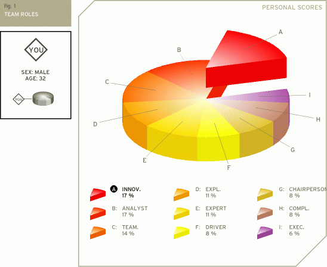

[123test.com](https://www.123test.com/team-roles-test) - The Team Roles Test

Result : 

# Your team roles

Your answers have been used to identify which team role(s) suits you best. This suitability is expressed as a percentage.

The nine team roles are the Executive, Explorer, Innovator, Analyst, Driver, Chairperson, Completer, Team player and Expert.

A total of 100 points are divided over the various roles. A group role can have up to 25 points. The graph below shows how each team role fits you. After the graph, each team role is explained in detail, in the order of its importance to you.

## Innovator
The innovator is often the creative generator of a team. He or she has a strong imagination and a desire to be original. The innovator prefers to be independent and tends to approach tasks in a scientific way. As a creative individual the innovator may play a crucial role in the way a team approaches tasks and solves problems.

## Analyst
The analyst has a tendency to be reserved and critical. The analyst will also react to plans and ideas in a rational and sensible way. He or she will favor a prudent approach to matters and will evaluate them according to their accuracy before acting.

## Team player
The team player is caring, avoids conflicts, and fosters harmony. Being someone who likes to help other people, the team player is generally considered agreeable and friendly. He or she is diplomatic and emphasizes solidarity and team cohesion.

## Explorer
The explorer is generally an extrovert by nature. He or she is cheerful, gregarious. The explorer is also investigative, interested and curious about things. Because explorers like to improvise and communicate with others, they will have little problem presenting ideas to the team and developing new contacts.

## Expert
The expert has the skills and expertise required for the specific task at hand. He or she has a strong focus on the task and may get defensive when others interfere with his or her work. The expert prefers to work alone and team members often have a great deal of trust and confidence in him or her.

## Driver
The driver is generally very ambitious and energetic. He or she may appear as impatient and impulsive. The driver is a strong motivator and will challenge others at crucial times. Although the actions of the driver may sometimes seem somewhat emotional, they do play a crucial role in pushing the team forward to succeed.

## Chairperson
The chairperson has a strong coordinating role. With an emphasis on procedures, the chairperson will try to bring and keep the team together. He or she is communicative and deals with the members of the team in a respectful and open-minded way.

## Completer
The completer is very conscientious and feels responsible for the team's achievements. Completers are concerned when errors are made and they tend to worry because of their controlling nature. The completer is also known as the finisher because they are most effectively used at the end of a task, to polish and scrutinize the work for errors, subjecting it to the highest standards of quality control.

## Executive
The executive is sometimes also referred to as the organizer. The executive is generally disciplined and eager to get the job done. He or she is efficient, practical, and systematic. Executives are well organized and diligent, and quickly turn the ideas of a team into concrete actions and practical plans.
