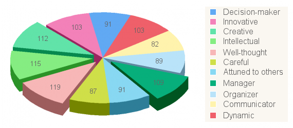

[TestColor](http://www.testcolor.com/personalitytest/personalitytest.php) - Free Color Personality Test that reveals your deepest truth

## Results of your test (2020)
Your results present a correlation ratio with our model superior to 37 %,
(Results can be taken into account if this ratio is superior to 30 %.)

### You are 48% extravert and 52% introvert.
You are able to have an in-depth thinking, you think before acting, and you know how to communicate your knowledge.
You are also imaginative and creative, you have always new ideas, and you know how to apply them.
You are a manager and a structured person, you know how to take into account the needs of each person while leading them towards the set goals.

### The qualities that characterize your personality :

#### 119	: Your insights.
You are thoughtful and deep, you think before getting into action and you know how to communicate your knowledge.

#### 115	: Your intellectual performance.
You are intellectual and intelligent, you wonder and you inquire before taking any action and setting your values.

#### 112 : Your imagination.
You are a creative person, with always new ideas, and you know how to apply them.

#### 109 : Your management skills.
You are a manager and a structured person, you know how to take into account the needs of each person while leading them to the fixed goals.

Finely you are creative, you know how to see beauty, you are intuitive and your inspiration comes from the inside.
You are dynamic and active, you are determined in your actions, you know how to communicate your ideals and your energy, and thus, you know how to boost people.
You are thoughtful and capable of listening to others, you take into account the needs of others before setting up the defined objectives.
