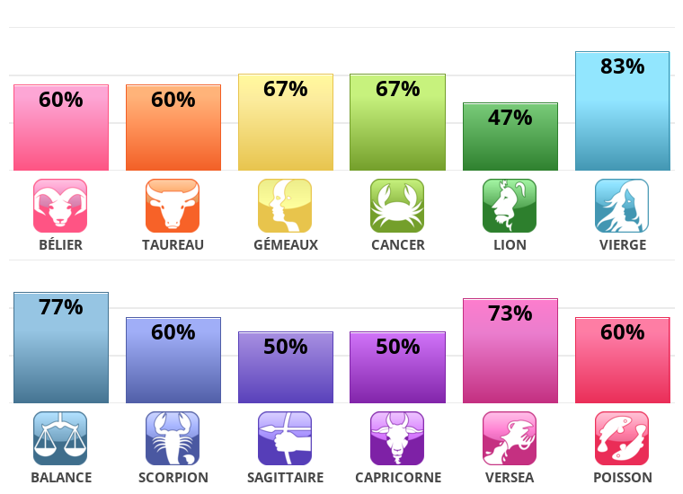

[True Zodiac Sign Test](https://www.idrlabs.com/true-zodiac-sign/test.php). 

**Alternative language :** [French](https://www.idrlabs.com/fr/vrai-signe-du-zodiaque/test.php)

## Résultat :fr: [FR]

**Vierge***
Analytique, diligent, modeste.

Votre vrai signe du zodiaque est la Vierge. Soucieux des détails et organisé, vous prenez les dispositions nécessaires pour que les choses soient bien faites du premier coup et vous vous efforcez de ne rien laisser au hasard. Votre besoin de perfection vous amène parfois à vous enliser dans les détails et à perdre de vue la situation dans son ensemble. Cependant, vous parvenez toujours à retrouver le chemin de la perspective la plus large pour rester en phase avec vous-même. Intelligent et travailleur, vous êtes un apprenant permanent qui recherche de nouvelles possibilités d'apprendre et qui s'émerveille devant la somme de la créativité humaine. Vous préférez un mode de vie tranquille et terre à terre, sans trop de contretemps, et vous vous sentez plus à l'aise lorsque vous avez des objectifs clairement définis et que vous savez comment atteindre. Bien que vous puissiez paraître timide ou réservé face aux personnes que vous ne connaissez pas, cela est dû en réalité à votre tendance à vous demander si quelqu'un est digne de votre énergie, de votre amitié et de votre confiance. Servir les autres est important pour vous, mais les amitiés dans lesquelles vous vous investissez doivent être authentiques.
